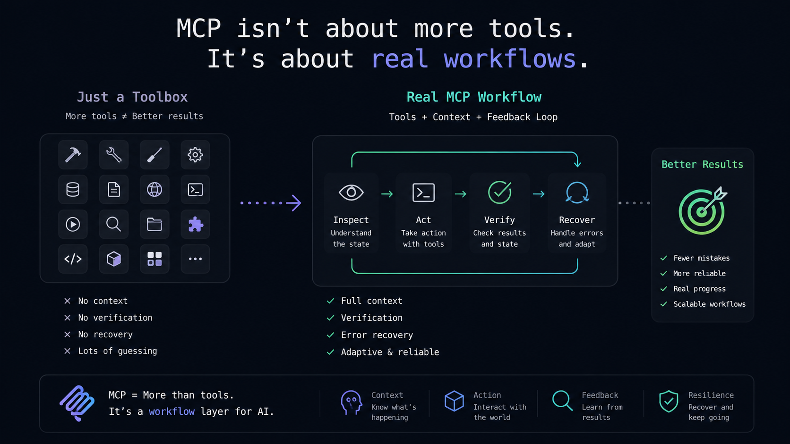
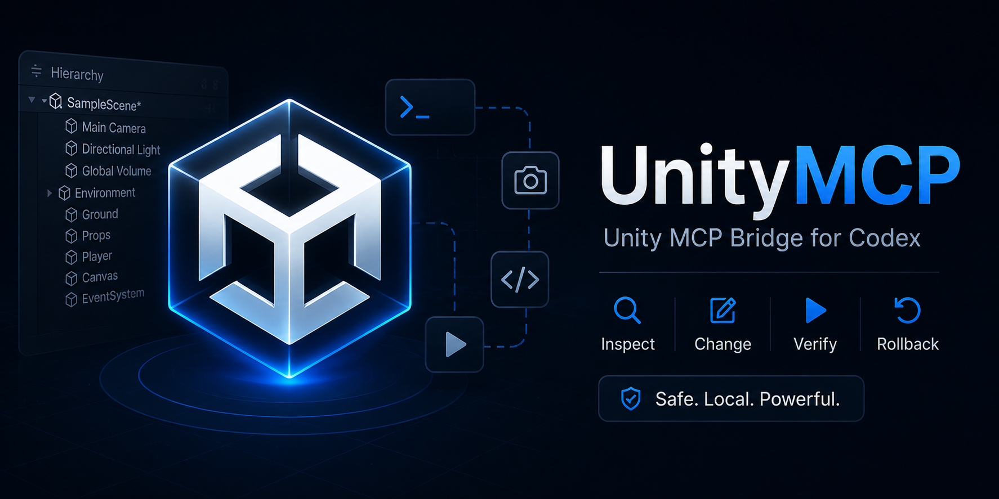

# Unity MCP




Unity automation bridge for MCP-compatible AI clients: inspect scenes, edit safely, run Play
Mode checks, take screenshots, and verify changes inside a live Unity project.

## What It Does

- Scene and hierarchy inspection
- Safe scene edits with rollback
- Play Mode control and runtime field access
- Game View input simulation
- Unity Console, screenshots, and Test Runner support
- Editor window focus, asset selection, pane screenshots, and session helpers

## Why It Matters

Your MCP client stops guessing blindly and gets a real Unity feedback loop:

`inspect -> change -> verify -> recover`



## Architecture

`MCP Client -> Python MCP Server -> Local Unity HTTP Bridge -> Unity Editor`

## Quick Install

### Unity Package

```text
https://github.com/HellterEnjoy/UnityMCP.git?path=/unity-package/Packages/com.codex.unity-mcp#main
```

### MCP Server Setup

```powershell
.\scripts\setup-unity-mcp-server.ps1
```

This prepares `server\.venv` and installs the MCP server for any client that can launch a local
command-based MCP process.

### Codex Helper

```powershell
.\scripts\install-codex-mcp.ps1
```

This keeps the Codex setup path one-command simple while the server itself stays client-agnostic.

## Project Status

`Experimental / early alpha`

Useful already, but the API and workflows may still change before `1.0`.

## Requirements

- Unity `2021.3+`
- Python `3.10+`
- Any MCP-compatible client that can launch a local command-based server
- Windows PowerShell for the provided install script

## Security Warning

The Unity bridge is local-only by design and listens on `127.0.0.1:8765`.
Do not expose it on a public network interface without authentication and tighter command
restrictions.

## Documentation

- [Installation](docs/INSTALLATION.md)
- [Core Workflows](docs/WORKFLOWS.md)
- [MCP Tools](docs/MCP_TOOLS.md)
- [Security](docs/SECURITY.md)
- [Development](docs/DEVELOPMENT.md)
- [Examples](docs/EXAMPLES.md)
- [Roadmap](ROADMAP.md)
- [License](LICENSE)

## Current Strengths

- Safe Edit Mode with snapshot, batch, rollback, and diff
- Semi-realtime gameplay testing loop
- Runtime field reads and writes during Play Mode
- Editor ergonomics tools for focus, selection, screenshots, console checkpoints, and session restore
- Works with Codex today and is structured to plug into other MCP clients without changing Unity-side tooling

## Known Limitations

- only supports a localhost bridge by default
- not a real-time video stream
- tested mainly on Windows and currently exercised most heavily through Codex
- Unity editor APIs and MCP tool shapes may still change before `1.0`
